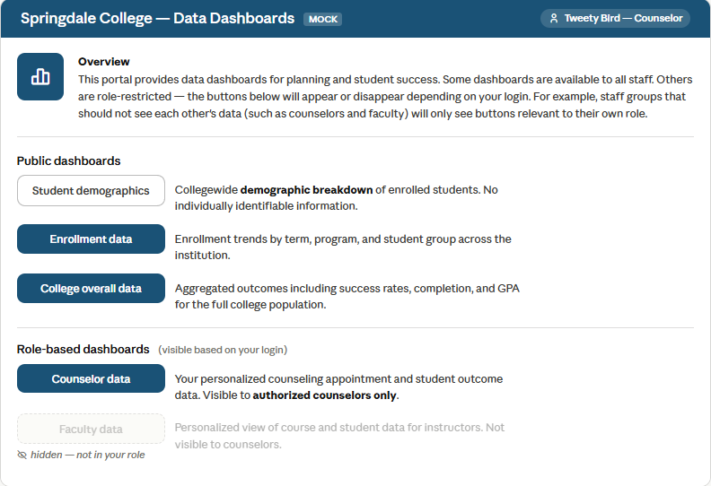

# Power BI — role-based navigation button visibility with DAX

A DAX pattern for showing or hiding Power BI navigation buttons based on the logged-in user's role. Different staff groups that should not see each other's data — for example counselors and faculty — will only see the buttons relevant to their own role. Everything is driven by Excel permission lists and conditional formatting, with no RLS required.

> I built this to consolidate 10+ separate dashboards into a single Power BI file with role-based navigation. I'm not a Power BI expert — if you see improvements, open an issue.

---

## The problem

A single Power BI file consolidates multiple dashboards for different staff roles. There is no built-in Power BI feature to conditionally show or hide navigation buttons based on who is logged in.

---

## What this builds

A navigation page where buttons appear or disappear based on the logged-in user's role. Unauthorized buttons become fully transparent and their page navigation action is disabled. Authorized buttons appear in the institution's brand color with white text.

**Counselor view — instructor button is hidden:**



*All names and data are fabricated for illustration.*

---

## How it works

Power BI buttons support conditional formatting for fill color, text color, and action. This pattern drives all three from DAX measures that check the logged-in user's email against the appropriate permission list.

```
USERPRINCIPALNAME()
        ↓
[CurrentUserEmail]
        ↓
[UserHasAccess.faculty] or [UserHasAccess.counselor]  (returns 1 or 0)
        ↓
ButtonColor    →  #B20838 (visible) or #FFFFFF00 (transparent)
ButtonTextColor →  #FFFFFF (visible) or #FFFFFF00 (transparent)
ButtonAction   →  "Page Name" (navigates) or BLANK() (disabled)
```

---

## Requirements

- Power BI Desktop and Power BI Service (published report)
- Users must log in with a Microsoft work account
- Two Excel permission files stored in a shared folder:

**Faculty permission list** (`1 Faculty Permission List.xlsx`):

| Name | Email | isAdmin |
|------|-------|---------|
| Bugs Bunny | bbunny@college.edu | 0 |
| Daffy Duck | dduck@college.edu | 1 |

**Counselor permission list** (`1 Counselor Permission List.xlsx`):

| Name | Email |
|------|-------|
| Tweety Bird | tbird@college.edu |
| Porky Pig | ppig@college.edu |

---

## Setup

1. Connect both Excel permission lists to your Power BI model
2. Create all seven measures in `measures.dax`
3. Add buttons to your navigation page for each role-based dashboard
4. For each button apply conditional formatting:
   - Fill color → use the appropriate `ButtonColor` measure
   - Text color → use `ButtonTextColor`
   - Action → Page navigation, use the appropriate `ButtonAction` measure
5. Publish to Power BI Service

---

## The measures

### `CurrentUserEmail`
Shared foundation. Only create this once per report.

```dax
CurrentUserEmail = 
VAR user = USERPRINCIPALNAME()
RETURN
IF(ISBLANK(user), "Unknown", user)
```

---

### Faculty button measures

```dax
UserHasAccess.faculty = 
IF(
    NOT(ISBLANK(
        LOOKUPVALUE(
            '1 Faculty Permission List'[Email],
            '1 Faculty Permission List'[Email],
            [CurrentUserEmail]
        )
    )),
    1, 0
)
```

```dax
ButtonColor.faculty = 
IF([UserHasAccess.faculty] = 1, "#B20838", "#FFFFFF00")
```

```dax
ButtonAction.faculty = 
IF([UserHasAccess.faculty] = 1, "Instructor Welcome Page", BLANK())
```

---

### Counselor button measures

```dax
UserHasAccess.counselor = 
IF(
    NOT(ISBLANK(
        LOOKUPVALUE(
            '1 Counselor Permission List'[Email],
            '1 Counselor Permission List'[Email],
            [CurrentUserEmail]
        )
    )),
    1, 0
)
```

```dax
ButtonColor.counselor = 
IF([UserHasAccess.counselor] = 1, "#B20838", "#FFFFFF00")
```

```dax
ButtonAction.counselor = 
IF([UserHasAccess.counselor] = 1, "Counselor Welcome Page", BLANK())
```

---

### Shared text color
One measure works for both button types.

```dax
ButtonTextColor = 
IF(
    [UserHasAccess.faculty] = 1 || [UserHasAccess.counselor] = 1,
    "#FFFFFF",
    "#FFFFFF00"
)
```

---

## Extending to other roles

To add a new role (for example, department deans), duplicate the counselor measure set and point it at a new permission list:

```dax
UserHasAccess.dean = 
IF(
    NOT(ISBLANK(
        LOOKUPVALUE(
            '1 Dean Permission List'[Email],
            '1 Dean Permission List'[Email],
            [CurrentUserEmail]
        )
    )),
    1, 0
)
```

Then create `ButtonColor.dean` and `ButtonAction.dean` following the same pattern.

---

## Important limitation

> **This is a UX-level pattern, not a security control.**

Transparent buttons are invisible, not removed. A user who knows Power BI can still navigate directly to any page if the page navigation pane is visible. Disable the page navigation pane in your published report's display settings to prevent this. This pattern controls the UI — it does not provide page-level security.
